# Ptium 사용자 가이드

이 문서는 Ptium 화면을 **쓰는 사람**을 위한 안내입니다. 서버를 띄우고 지키는 일은
[관리자 가이드](ADMIN_GUIDE.md)에 있습니다. 같은 내용을 제품 안에서도 **사용 가이드**(`/guide`)
화면으로 볼 수 있고, 편집기와 발표 화면에서는 아무 때나 <kbd>?</kbd>를 눌러 단축키를 볼 수 있습니다.

실린 화면은 모두 Ptium v1.69.32 를 실제로 띄워 찍은 것입니다. 데이터는 예시(`데모 회사`,
`hong@example.com`)입니다.

## 1. 이 제품이 하는 일

Ptium은 **쓴 글**을 **가지고 있는 템플릿**에 맞춰 슬라이드로 그립니다. 무엇을 발표할지 두세 문장으로
적으면 개요를 잡고 문안을 써서 표지·본문·마무리가 갖춰진 덱을 만들고, 회사 PowerPoint 템플릿을
올려 두었으면 그 파일의 레이아웃·글꼴·색 그대로 채웁니다. 결과는 브라우저에서 바로 고치고, 편집
가능한 PPTX 나 PDF 로 받습니다.

덱의 재료가 이미 있다면 새로 쓰지 않아도 됩니다. 엑셀·CSV·워드·PDF·마크다운·기존 PPTX 를 올리면
시트는 표나 차트로, 보고서는 제목이 슬라이드로 바뀌고, **각 장에 어디에서 왔는지 출처가 붙습니다**.

쓰는 사람은 보고서를 자주 만드는 실무자와 팀장입니다. AI 공급자가 연결돼 있지 않은 폐쇄망에서도
내장 작성기가 완결된 덱을 만들므로, 연결 여부는 관리자가 정하고 사용법은 같습니다.

## 2. 처음 5분

### 로그인

관리자가 알려 준 주소를 열면 로그인 화면이 나옵니다. 배포에 따라 **아이디·비밀번호**, 조직
**SSO**(OIDC), 또는 평가용 **개발 환경 액세스** 가운데 하나가 보입니다 — 어떤 방식인지는 관리자가
정합니다.


### 첫 덱 만들기

1. 홈 또는 왼쪽 메뉴의 **새로 만들기**에서 무엇을 발표할지 두세 문장으로 적습니다.

   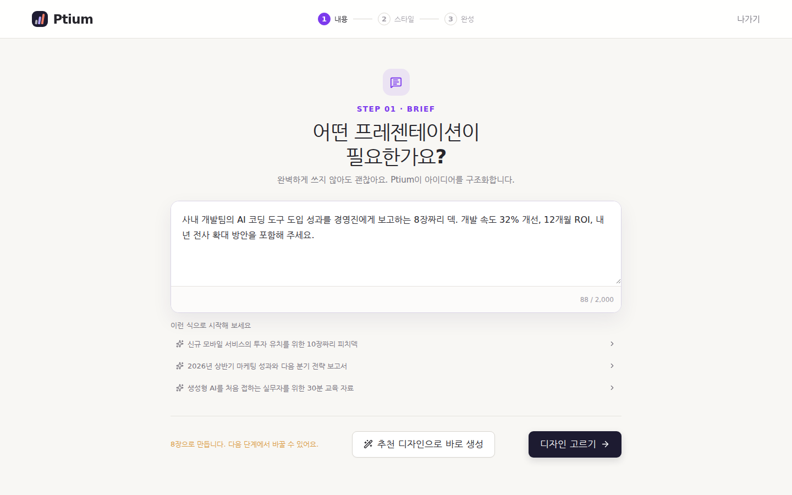

2. **추천 디자인으로 바로 생성**을 누르거나, **디자인 고르기**로 넘어가 제목·청중·발표 톤·슬라이드 수·
   언어를 조정하고 디자인을 고릅니다. 주제에 어울리는 디자인이 먼저 제안됩니다.

   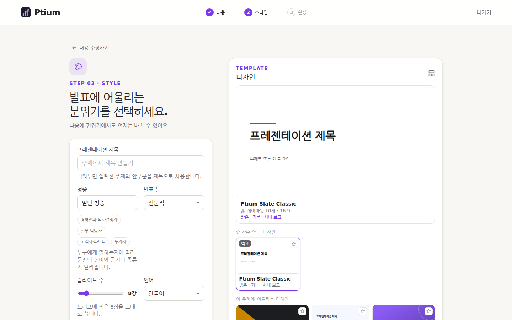

3. 편집기가 열리고, 생성이 끝나면 슬라이드가 채워집니다.
4. 왼쪽 목록에서 장을 고르고, 캔버스에서 **더블클릭**해 글을 고칩니다.

   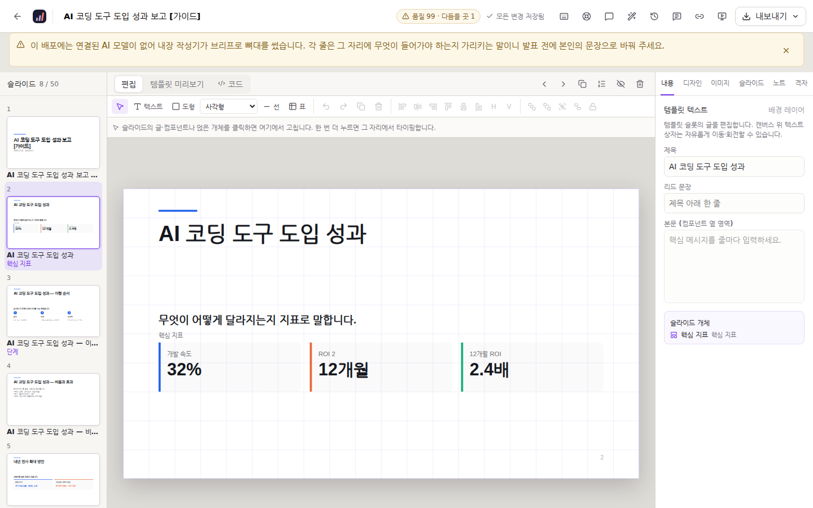

5. **발표**(<kbd>F5</kbd>)로 보여 주거나 **내보내기**로 PowerPoint 파일을 받습니다.

저장 버튼은 없습니다. 고치는 즉시 자동 저장되고(<kbd>Ctrl</kbd>+<kbd>S</kbd>로 지금 저장),
**버전 이력**에서 예전 상태로 되돌릴 수 있습니다.

> 편집기 위에 노란 띠로 "이 배포에는 연결된 AI 모델이 없어 내장 작성기가 브리프로 뼈대를 썼습니다"
> 가 보이면, 관리자가 AI 모델을 연결하지 않은 배포입니다. 덱은 완결돼 있지만 각 줄은 그 자리에
> 무엇이 들어가야 하는지 가리키는 말이니 발표 전에 본인의 문장으로 바꾸세요.

### 브리프 잘 쓰기

생성 품질의 대부분은 첫 화면에 적는 몇 문장에서 결정됩니다.

| 넣을 것 | 왜 |
| --- | --- |
| **주제** | "AI 도입"보다 "사내 개발팀의 AI 코딩 도구 도입 성과" |
| **청중** | 같은 내용도 경영진용과 실무자용은 다른 덱입니다 |
| **목적** | 승인·공유·교육 중 무엇인지에 따라 결론의 자리가 달라집니다 |
| **숫자** | 아는 수치를 적으면 지표로 그려집니다. 적지 않은 숫자를 지어내지는 않습니다 |

```
아쉬운 브리프:  AI 도입 발표자료 만들어줘

좋은 브리프:    사내 개발팀의 AI 코딩 도구 도입 성과를 경영진에게 보고하는 8장짜리 덱.
               개발 속도 32% 개선, 12개월 ROI, 내년 전사 확대 방안을 포함해줘.
```

## 3. 화면별 사용법

### 홈

로그인하면 처음 보는 화면입니다. 위쪽 입력칸에 바로 브리프를 적어 **시작하기**를 누를 수 있고,
**최근 프레젠테이션**에서 마지막으로 작업한 덱을 이어서 엽니다. 관리자 계정이면 왼쪽 메뉴 아래에
**관리** 구역이 함께 보입니다.

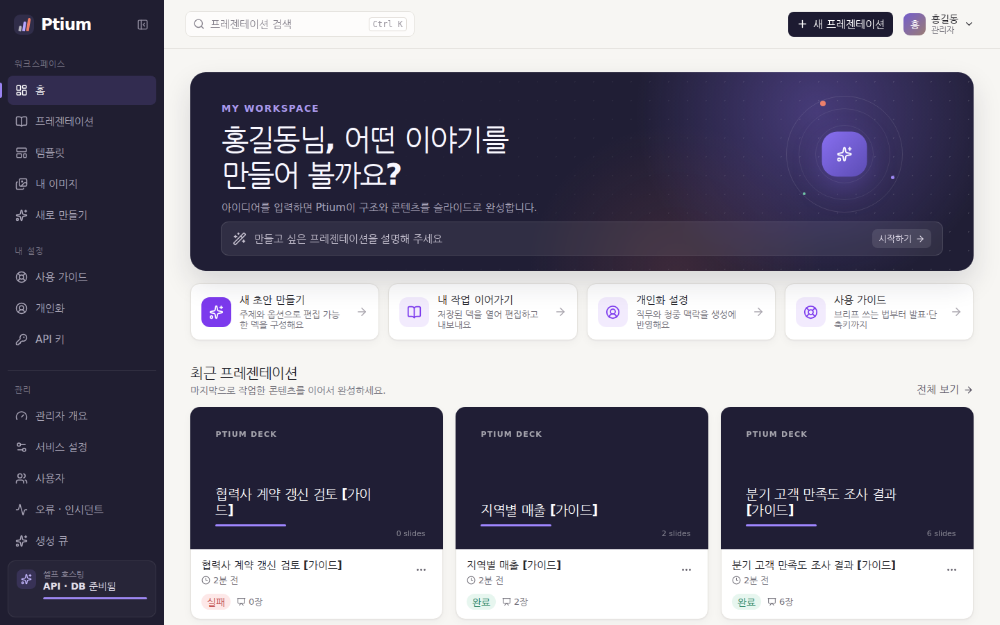

### 프레젠테이션

내 덱 전부입니다. 제목과 프롬프트로 검색하고 **전체 · 완료 · 초안 · 생성 중 · 휴지통**으로 좁힙니다.
카드의 **…** 메뉴에서 복제·삭제를 하고, 삭제한 덱은 **휴지통**에서 복원하거나 영구 삭제합니다 —
영구 삭제는 휴지통 안에서만 되고, 프레젠테이션과 모든 버전 이력이 함께 지워집니다.

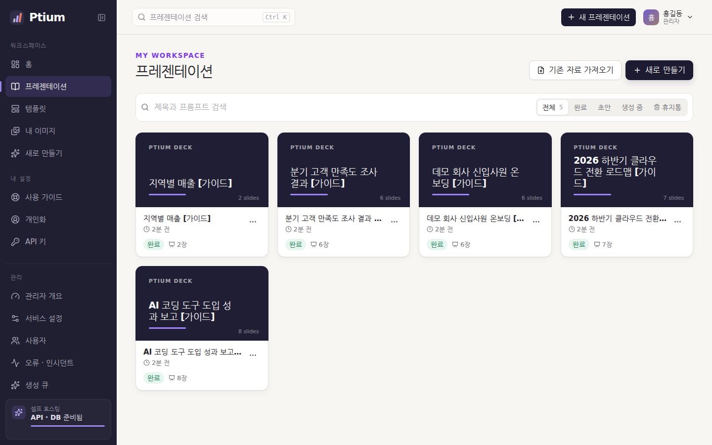

오른쪽 위 **기존 자료 가져오기**가 파일에서 덱을 만드는 입구입니다(4장 참고).

### 새로 만들기

2단계 화면입니다. **내용**(브리프)과 **스타일**(제목·청중·톤·장수·언어·디자인)을 거쳐 편집기로
갑니다. 브리프에 "8장짜리"처럼 장수를 적으면 그 수를 그대로 쓰고, 다음 단계에서 바꿀 수 있습니다.
디자인은 편집기에서도 언제든 바꿀 수 있고 글은 그대로 옮겨집니다.

### 템플릿

기본 제공 디자인은 50종입니다. 밝기·구성·성격 태그로 좁혀 고르고, 별표를 눌러 둔 디자인과
**실제로 덱을 만든** 디자인은 **자주 쓰는 디자인**으로 맨 앞에 모입니다.

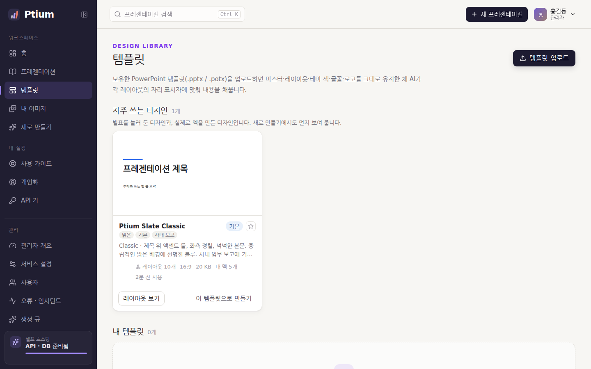

- **템플릿 업로드** — 가지고 있는 `.pptx` 또는 `.potx`를 올리면 그 파일의 레이아웃·글꼴·색으로
  생성합니다. 슬라이드 마스터에 제목+본문, 2단, 그림 자리가 있는 파일일수록 잘 맞습니다.
  (관리자가 서비스 설정에서 사용자 업로드를 꺼 두었으면 거절됩니다.)
- **레이아웃 보기** — 그 디자인이 가진 레이아웃을 미리 봅니다.
- **메타포 계열** — Orbit(성장)·Arc(여정)·Diagonal(전환)·Dots(데이터)·Layers(구조)·Wash(비전)는
  표지에서 도형으로 이야기를 한 번 말합니다.

### 내 이미지

올린 이미지는 계정에 남아 모든 덱에서 다시 씁니다.

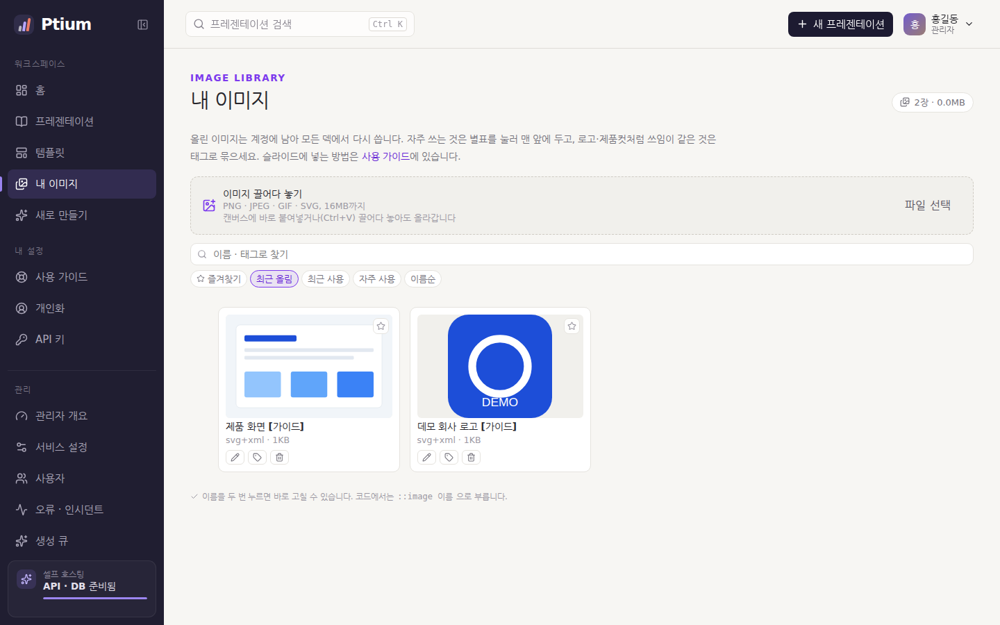

| | |
| --- | --- |
| **즐겨찾기** | 별표를 누르면 어느 정렬에서도 맨 앞. 로고처럼 매번 쓰는 것에 |
| **태그** | 로고·제품컷·배경처럼 쓰임으로 묶기. 태그를 누르면 그것만 |
| **덱 N개** | 그 이미지를 실제로 쓰는 덱의 수. 저장할 때마다 다시 셉니다 |
| **정렬** | 최근 올림 · 최근 사용 · 자주 사용 · 이름순 |
| **이름 바꾸기** | 이름을 두 번 누르면 바로. 코드에서 부르던 이름도 함께 바뀝니다 |

PNG · JPEG · GIF · SVG, 한 장당 16MB까지. 같은 이름으로 다시 올리면 교체되므로, 로고를 바꾸면
그 이름을 쓰던 덱들이 함께 바뀝니다. 같은 파일을 다시 올리면 새로 만들지 않고 이미 있는
이미지를 씁니다.

### 편집기

캔버스에는 성격이 다른 두 가지가 있습니다.

| | 템플릿 영역 | 덧붙인 개체 |
| --- | --- | --- |
| 무엇 | 제목·본문처럼 템플릿이 정해 준 자리 | 글상자·도형·표·이미지 |
| 누가 채움 | AI 생성 결과가 들어감 | 내가 얹음 |
| 할 수 있는 것 | 편집·이동·**원래 자리로**·AI로 다시 쓰기 | 자유 배치·그룹·정렬·순서 |
| 내보내면 | 진짜 자리 표시자 | 진짜 도형·표·그림 |

- 위쪽 도구 막대의 **텍스트 · 도형 · 선 · 표**로 개체를 얹고, 오른쪽 패널의 **내용 · 디자인 · 이미지 ·
  슬라이드 · 노트 · 격자** 탭에서 그 장의 글·디자인·발표자 노트를 다룹니다.
- **AI로 다시 쓰기** — 영역을 오른쪽 클릭하면 그 한 장만 다시 씁니다. 되돌릴 수 있습니다.
- **품질 배지** — 위쪽 가운데 `품질 99 · 다듬을 곳 1` 처럼 보입니다. 누르면 무엇을 재서 그 점수가
  나왔는지 보여 줍니다(아래 "품질 점수").

**코드 탭.** 덱은 원래 텍스트입니다. **코드**를 누르면 덱 전체를 글로 보고 고칠 수 있고, **적용**을
누르면 템플릿에 맞춰 다시 그립니다. 전체 문법은 [deck-source.md](deck-source.md)에 있습니다.

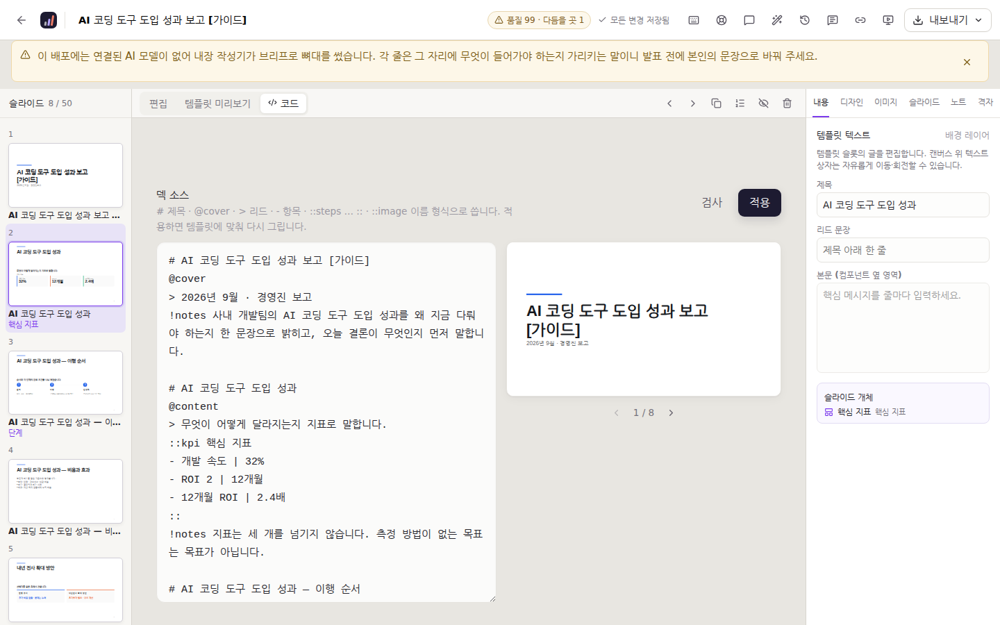

```
# 클라우드 전환 로드맵
@cover
> 2026년 하반기 · 임원 보고

# 왜 지금인가
- 온프레미스 계약이 9월에 끝납니다
- 재계약가는 전년 대비 22% 인상됩니다
::kpi 핵심 지표
- 전환 대상 | 42개
- 예상 절감 | 18%
::
!notes 예산 질문이 나오면 3장의 표를 보여 줍니다.
```

**버전 이력.** 자동 저장은 5분 단위로 묶이고, 코드 적용·재생성·복원 전에는 별도 체크포인트가
남습니다. 위쪽 시계 모양 버튼을 누르면 목록이 열리고, **복원**으로 그때로 돌아갑니다. 복원 직전
상태도 다시 기록되므로 복원을 되돌릴 수도 있습니다.

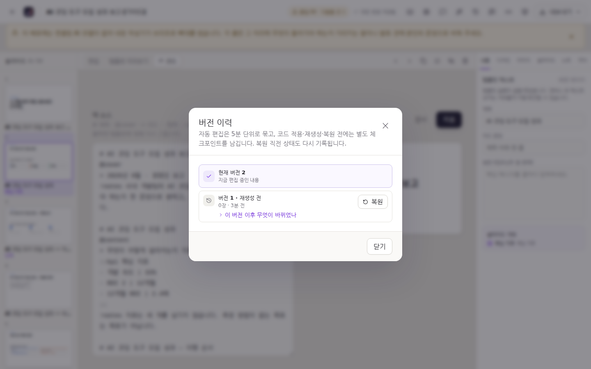

**명령.** 편집기 위 **명령**을 누르고 하고 싶은 일을 그대로 적습니다.

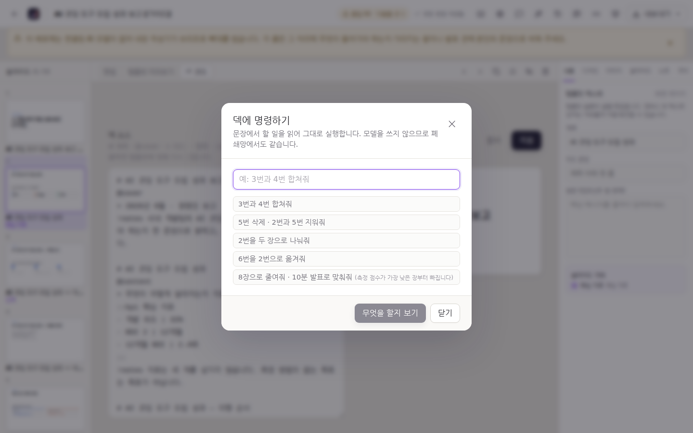

```
3번과 4번 합쳐줘
5번 삭제 · 2번과 5번 지워줘
2번을 두 장으로 나눠줘
6번을 2번으로 옮겨줘
8장으로 줄여줘 · 10분 발표로 맞춰줘
```

- **무엇을 할지 먼저 보여 줍니다.** 읽은 문장을 되돌려 주고, 몇 장이 몇 장이 되는지 말한 다음
  적용합니다. 확인할 수 없는 명령은 실행하지 않습니다.
- **모델을 쓰지 않습니다.** 합치고 나누고 옮기는 일에는 정답이 하나뿐이라 문장을 읽는 편이 더
  빠르고 정확하며, 모델이 없는 폐쇄망에서도 똑같이 됩니다.
- **합칠 때 잃지 않습니다** — 요점도, 발표자 노트도, 출처도 함께 옮겨집니다.
- **줄일 때는 측정 점수가 가장 낮은 장부터** 빠지고, 표지와 마무리는 남습니다.
- 발표 시간으로 맞추면 **한 장에 2분**으로 계산합니다.

**공유.** 링크 모양 버튼으로 **계정이 없는 사람도 볼 수 있는 링크**를 만듭니다. 며칠 뒤 만료되게 정할 수
있고, 링크로 본 사람이 남긴 의견은 **의견** 버튼에 모입니다. 만든 링크는 언제든 끊을 수 있습니다.

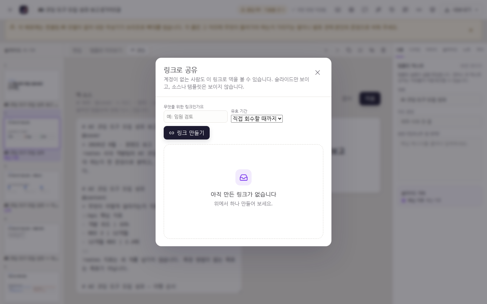

**AI로 다듬기(덱 전체).** 마술봉 버튼은 덱 전체를 모델에게 보내 다시 쓰게 합니다. **무엇을 바꿀지
적는 칸**에 "3장은 요점 3개로 줄이고, 5장에 비용 비교 표를 넣어 주세요"처럼 적으면 **그것만**
바뀝니다. 숫자와 사실은 그대로 두고, 이전 상태는 버전 이력에 남습니다. AI 제공자가 설정돼 있어야
하며, 없으면 그렇다고 말하고 아무것도 바꾸지 않습니다.

### 품질 점수

편집기 위쪽 배지를 누르면 **가독성 · 구성 · 시각 · 접근성 · 근거** 다섯 축과, **가장 낮은 슬라이드**로
바로 가는 버튼이 나옵니다.

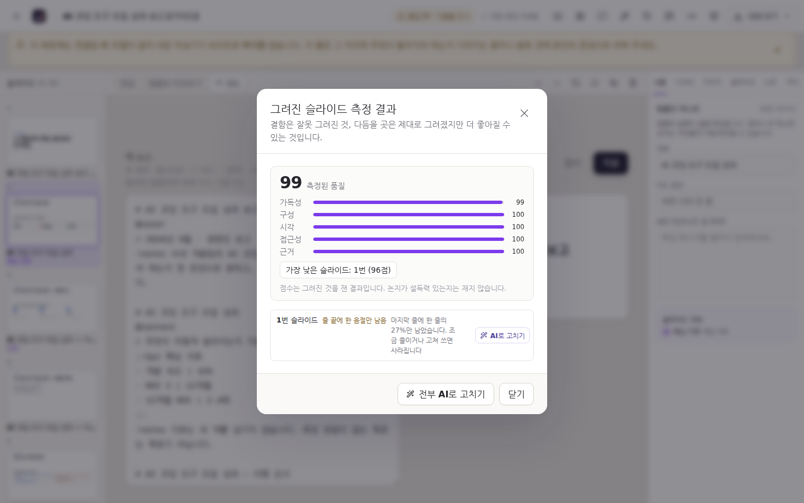

계산 규칙은 한 문장입니다. **슬라이드마다 100에서 시작해 측정된 것만큼 깎입니다.** 잘못 그려진
것(넘침 · 밖으로 나감 · 겹침 · 대비)은 크게, 다듬을 곳(노트 없음 · 중복 · 빽빽함 · 외톨이 줄)은 작게
깎입니다. 점수는 **그려진 것**을 잽니다. 논지가 설득력 있는지, 숫자가 맞는지는 재지 않습니다.

발표 노트가 슬라이드에 적힌 말과 똑같으면 `발표 노트가 슬라이드와 같은 말` 로 표시합니다.
청중이 읽고 있는 문장을 발표자가 소리 내어 읽으면 그 장에서 말할 것이 없어집니다.
`발표 노트 초안` 을 누르면 그 장이 무엇을 담고 있는지에 따라 **할 일**을 적어 줍니다 —
단계가 있으면 완료 조건을, 지표가 있으면 그 숫자가 왜 그렇게 나왔는지를 말하라고 하고,
마지막에 다음 장으로 넘기는 말을 붙입니다.

글이 상자보다 많으면 Ptium 은 글자를 줄여서 넣습니다. 그렇게 해서 뒷자리에서 읽히는 18pt
보다 작아지면 `글자가 너무 작아짐` 으로 표시하고, 템플릿이 요구하는 크기와 실제로 그려질
크기를 함께 말합니다. `두 장으로 나누기` 를 누르면 내용을 하나도 버리지 않고 나눕니다.
템플릿 자체가 작게 설계된 경우는 이 사람이 손댈 수 있는 일이 아니므로 말하지 않습니다.

숫자를 말하면서 출처가 하나도 없는 슬라이드는 `숫자의 출처 없음` 으로 표시되고 **근거** 축이
내려갑니다. 소스에 `^1` 표시와 `!source 1 | 제목 | 어디` 를 적으면 발표자 노트 끝에 출처 목록이
붙습니다(한 장에 최대 12개).

### 발표

- **발표**(<kbd>F5</kbd>) — 청중 화면에는 슬라이드만 나옵니다.
- **발표자 보기**(<kbd>P</kbd>) — 두 번째 창에 다음 장·노트·경과 시간. 프로젝터에 발표 창을,
  노트북에 발표자 창을 두세요. 어느 쪽에서 넘겨도 함께 움직입니다.
- 소스에 `!skip` 을 적은 장은 발표와 인쇄에서 건너뜁니다.

### 개인화 · API 키

**개인화**(`/profile`)에서 회사·직무·기본 청중·톤·언어·브랜드 색을 저장하면 새 덱의 기본값이
됩니다.

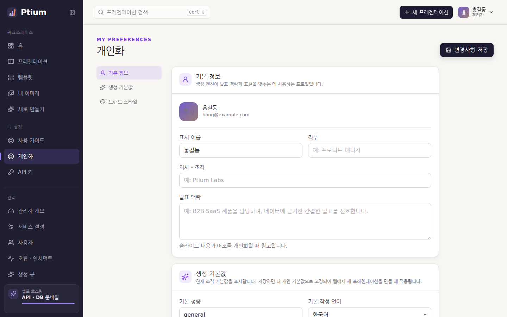

**API 키**(`/api-keys`)는 스크립트나 MCP 클라이언트가 내 계정으로 Ptium 을 쓰게 하는 열쇠입니다.
키의 전체 값은 **만든 직후 한 번만** 보이고, 그 뒤에는 앞자리만 남습니다. 범위(권한)와 만료일을
정하고, **회전**하면 새 키가 나오면서 이전 키는 유예 기간 동안 함께 동작합니다.

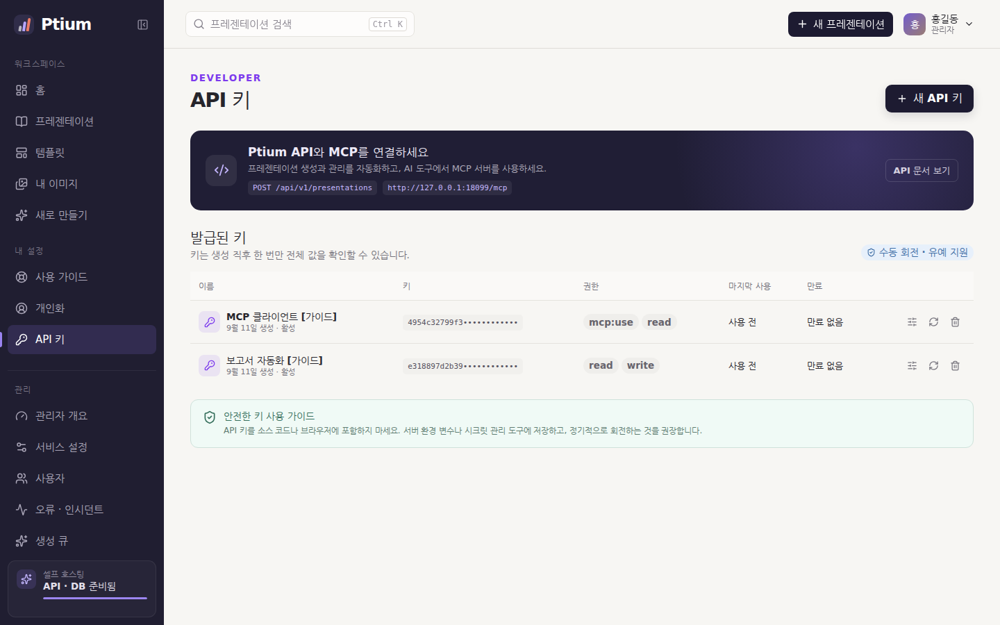

**API 문서 보기**(`/docs`)에 REST 엔드포인트 목록과 인증 헤더 예시가 있습니다.

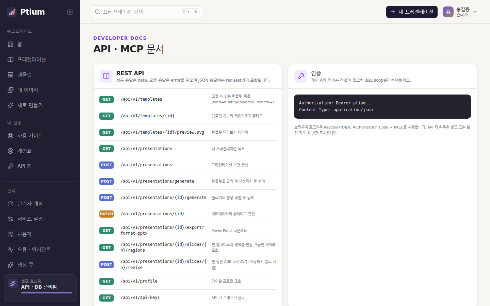

### 사용 가이드 (제품 안)

왼쪽 메뉴 **사용 가이드**(`/guide`)에 이 문서의 핵심이 화면 안에 들어 있습니다. 브리프 쓰는 법부터
단축키·잘 안 될 때까지 절마다 바로 가고, **바로 만들어 보기**로 새로 만들기로 넘어갑니다.

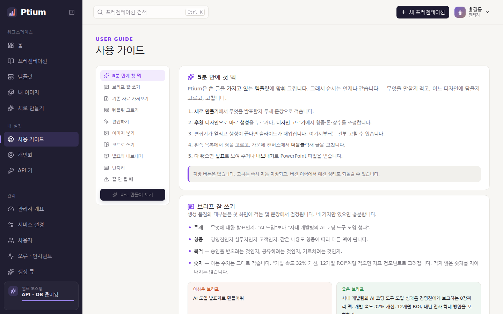

## 4. 자주 하는 작업

### 지난 분기 보고서에서 덱 만들기

**프레젠테이션 → 기존 자료 가져오기**에 파일을 올립니다. 발표자료가 아니어도 됩니다.

| 올리는 것 | 되는 것 |
| --- | --- |
| `.pptx` | 제목·요점·노트·표·그림·차트(숫자째)가 넘어오고, 새 덱의 디자인으로 다시 그려집니다 |
| `.xlsx` · `.csv` · `.tsv` | 시트마다 한 장. 라벨 한 열 + 숫자 한 열이면 **차트**, 넓으면 **표** |
| `.docx` | 제목이 슬라이드, 그 아래 문장이 요점, 표는 표 |
| `.pdf` | 한 쪽이 한 장. 첫 줄이 제목, 반복되는 머리글·꼬리글과 쪽 번호는 빼고, 출처는 몇 쪽인지 |
| `.md` · `.txt` | `#` 이 슬라이드, `-` 이 요점, 파이프 표는 표 |

**각 장에 출처가 붙습니다** — `!source 매출.xlsx | 분기 실적!A1:B5` 처럼 파일과 그 안의 자리까지.
`.pdf` 는 글자가 살아 있는 파일만 읽고, 스캔본은 빈 덱을 만들지 않고 무엇이 문제인지 알려 줍니다.
가져온 뒤에는 보통 덱입니다 — 템플릿을 바꾸고, 글을 고치고, AI로 다시 쓰게 할 수 있습니다.

### 회사 소개처럼 매번 같은 슬라이드 재사용하기

편집기 오른쪽 **슬라이드** 탭에서 지금 장을 저장해 두면 어느 덱에나 넣을 수 있습니다. 그림이
아니라 **글로 저장**되므로 넣는 순간 **그 덱의 디자인**으로 다시 그려지고, 같은 이름으로 다시
저장하면 갱신됩니다. 생성도 새로 쓰기 전에 이 라이브러리를 먼저 봅니다 — 제목이 등록된
슬라이드의 이름이나 태그를 분명히 가리킬 때만 그것을 쓰고, 썼으면 말해 줍니다. 표지는 절대
바꾸지 않습니다.

### 이미지 넣기

- **붙여넣기** — 캡처한 이미지를 캔버스에서 <kbd>Ctrl</kbd>+<kbd>V</kbd>.
- **끌어다 놓기** — 이미지 파일을 캔버스에 놓으면 놓은 자리에 들어갑니다.
- **영역 채우기** — 그림 자리가 있는 레이아웃이면 그 영역을 오른쪽 클릭 → 이미지.
- **코드에서** — `::image 로고` 로 부릅니다. `::image 로고 | 2026 브랜드 마크` 처럼 설명을 붙이면
  대체 텍스트가 되고, 레이아웃에 글자리가 남아 있으면 캡션으로도 보입니다.

### 내보내기

편집기 오른쪽 위 **내보내기**에서 셋 중 하나를 고릅니다.

| | 언제 |
| --- | --- |
| **PPTX** | 계속 편집할 때. 도형·표·차트가 진짜 개체이고 자리 표시자가 그대로 남습니다. 차트는 **데이터 편집**으로 숫자를 고칠 수 있습니다 |
| **PDF** | 배포할 때. 화면과 같은 그림에 글자가 글자로 남고(복사·검색됨), 링크가 살아 있고, 건너뛴 장은 인쇄되지 않습니다 |
| **PDF · 발표자 노트** | 리허설하거나 대신 발표할 사람에게 넘길 때. 한 장에 슬라이드 하나와 그 아래 노트 |

PDF 의 글꼴은 워크스페이스가 싣고 있는 나눔바른고딕입니다. 템플릿 글꼴 그대로가 필요하면 PPTX 를
받아 그 글꼴이 설치된 컴퓨터에서 저장하세요.

### 단축키

<kbd>?</kbd> 를 누르면 화면 안에서도 볼 수 있습니다.

**편집기**

| | |
| --- | --- |
| <kbd>Ctrl</kbd>+<kbd>S</kbd> | 지금 저장 (평소에는 자동 저장) |
| <kbd>F5</kbd> | 발표 시작 |
| <kbd>Ctrl</kbd>+<kbd>Enter</kbd> | 슬라이드 추가 |
| <kbd>Alt</kbd>+<kbd>↑</kbd> / <kbd>↓</kbd> | 슬라이드 순서 이동 |
| <kbd>Alt</kbd>+<kbd>PageUp</kbd> / <kbd>PageDown</kbd> | 이전 · 다음 슬라이드 선택 |
| 더블클릭 | 글상자 · 영역 텍스트 편집 |
| 빈 곳에서 끌기 | 여러 개 선택 |
| <kbd>Shift</kbd>+끌기 | 축 고정 · 비율 유지 · 15° 회전 |
| <kbd>Alt</kbd>+끌기 | 복제하며 끌기 |
| <kbd>Ctrl</kbd>+<kbd>Z</kbd> / <kbd>Shift</kbd>+<kbd>Z</kbd> | 실행 취소 · 다시 실행 |
| <kbd>Ctrl</kbd>+<kbd>C</kbd> / <kbd>V</kbd> / <kbd>D</kbd> | 복사 · 붙여넣기 · 복제 |
| <kbd>Ctrl</kbd>+<kbd>G</kbd> | 그룹 (<kbd>Shift</kbd>로 해제) |
| <kbd>Ctrl</kbd>+<kbd>]</kbd> / <kbd>[</kbd> | 맨 앞으로 · 맨 뒤로 |
| 방향키 | 조금씩 이동 (<kbd>Shift</kbd>로 크게) |
| <kbd>Delete</kbd> | 삭제 |

**발표 중**

| | |
| --- | --- |
| <kbd>→</kbd> <kbd>Space</kbd> <kbd>PageDown</kbd> | 다음 |
| <kbd>←</kbd> <kbd>PageUp</kbd> | 이전 |
| 숫자 + <kbd>Enter</kbd> | 그 번호의 슬라이드로 |
| <kbd>G</kbd> | 전체 슬라이드 목록 |
| <kbd>B</kbd> / <kbd>W</kbd> | 검은 화면 · 흰 화면 |
| <kbd>L</kbd> | 레이저 포인터 |
| <kbd>F</kbd> | 전체 화면 |
| <kbd>P</kbd> | 발표자 보기 창 |
| <kbd>Esc</kbd> | 발표 종료 |

## 5. 막혔을 때

화면에 나오는 문구를 그대로 실었습니다. **관리자에게**라고 적힌 것은 사용자가 고칠 수 없는 것입니다.

| 화면에 보이는 것 | 무엇을 하면 되나 |
| --- | --- |
| **슬라이드 생성에 실패했습니다** (편집기) | 그 아래 이유가 그대로 나옵니다. **생성 다시 시도**를 누르면 같은 브리프로 다시 씁니다. "AI 서비스가 요청을 거부했습니다(인증)" 처럼 모델 쪽 이유라면 **관리자에게** 서비스 설정의 AI 모델 항목을 확인해 달라고 하세요 — 관리자는 같은 덱을 생성 큐에서 보고 있습니다 |
| **이 배포에는 연결된 AI 모델이 없어 내장 작성기가 브리프로 뼈대를 썼습니다** | 오류가 아닙니다. 덱은 완결돼 있으니 각 줄을 본인의 문장으로 바꾸세요. 모델 연결은 **관리자**가 합니다 |
| **현재 편집 내용을 조용히 덮어쓰지 않았습니다. 서버의 최신 내용을 불러오거나, 내 변경을 최신 버전 위에 다시 저장할 수 있습니다** | 다른 탭이나 다른 사람이 먼저 저장했습니다. 둘 중 하나를 고르세요. 어느 쪽이든 이전 상태는 버전 이력에 있습니다 |
| **이 PDF에는 글자가 없습니다. 스캔했거나 그림으로 내보낸 파일로 보입니다** | 원본 문서나 텍스트가 살아 있는 PDF 로 올리세요 |
| **이 PDF가 한 번에 읽기에 너무 큽니다. 쪽을 나눠서 올려주세요** | 쪽을 나눠 여러 번 올리세요 |
| **이 통합 문서에는 읽을 표가 없습니다** · **이 통합 문서의 시트(…)는 모두 숨겨져 있습니다** | 표가 있는 시트를 숨김 해제하거나, 표만 따로 저장해 올리세요 |
| **이 파일의 글자를 읽지 못했습니다. UTF-8 이나 CP949 로 저장한 뒤 다시 올려 주세요** | CSV·TXT 의 인코딩 문제입니다. 다른 이름으로 저장하며 인코딩을 고르세요 |
| **문서보안(DRM)으로 잠긴 파일입니다. 보안을 해제한 .pptx 파일을 올려 주세요** | DRM 을 풀고 다시 저장한 파일을 올리세요 |
| **PowerPoint 파일로 열리지 않습니다. 파일이 손상됐거나 PowerPoint 파일이 아닐 수 있습니다** | PowerPoint 에서 열어 [다른 이름으로 저장] → .pptx 로 다시 저장하세요 |
| **이미 같은 이름의 이미지가 있습니다** | 다른 이름을 붙이거나, 교체하려는 것이면 내 이미지에서 그 이름의 이미지를 지우고 올리세요 |
| **이 덱에는 다시 쓸 내용이 없습니다. 먼저 슬라이드를 만들거나 가져오세요** | 빈 덱에 AI로 다듬기를 눌렀습니다. 먼저 생성하거나 자료를 가져오세요 |
| 글자가 넘쳐요 | 품질 배지의 "결함"을 눌러 그 장으로 가서, 요점을 줄이거나 담을 수 있는 레이아웃으로 바꾸거나 AI로 다시 쓰기를 쓰세요 |
| 글자가 너무 작아 보여요 | 품질 배지에 `글자가 너무 작아짐` 이 있으면 그 장의 글이 상자보다 많은 것입니다. `두 장으로 나누기` 를 누르거나 요점을 줄이세요 |
| 올린 템플릿이 어색해요 | 레이아웃이 적은 템플릿은 모든 슬라이드가 같은 모양이 됩니다. 마스터에 본문·2단·그림 자리가 있는 파일을 쓰세요 |
| 이미지가 안 보여요 | 저장소에서 사라진 것입니다(저장 위치 변경, 볼륨 복원 누락). 같은 이름으로 다시 올리면 교체됩니다. 반복되면 **관리자에게** |
| 로그인이 자꾸 풀려요 | 세션 기간(기본 12시간)은 **관리자**가 정합니다. 비밀번호를 바꾸면 다른 브라우저의 세션이 모두 끊기는 것은 정상입니다 |
| 내보내기가 `503` 으로 잠시 거절돼요 | 배포가 한 번에 만들 수 있는 문서 수를 넘었습니다. 잠시 뒤 다시 누르세요 |
| **관리자 권한이 필요합니다** | `/admin` 아래는 관리자만 들어갑니다. 필요하면 **관리자에게** 역할을 요청하세요 |

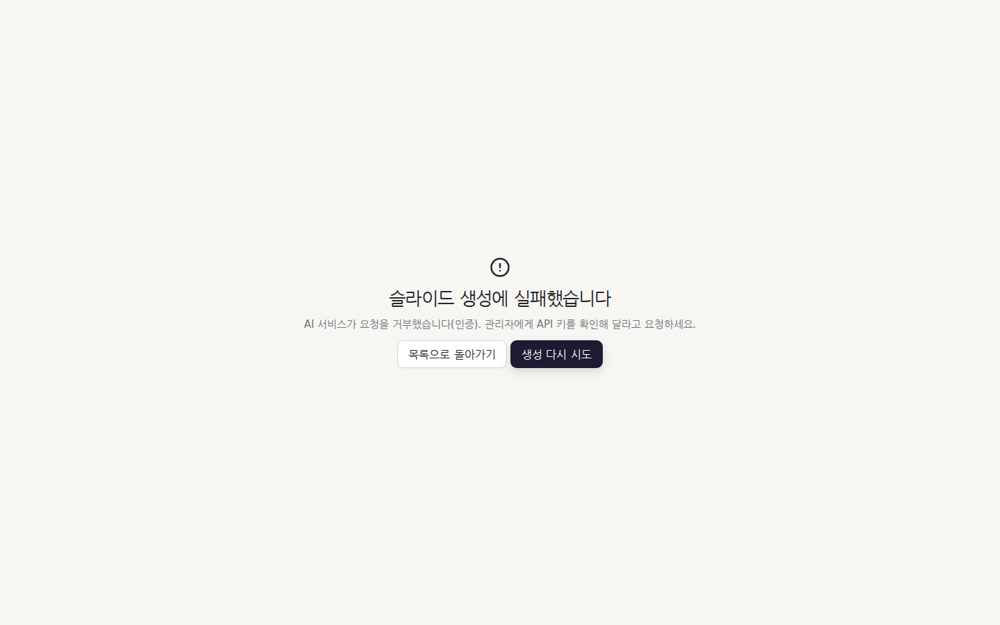

## 6. 용어

| 말 | 뜻 |
| --- | --- |
| **브리프** | 무엇을 발표할지 적은 두세 문장. 생성의 입력 |
| **덱** | 프레젠테이션 한 편 |
| **디자인 · 템플릿** | 슬라이드의 레이아웃·글꼴·색. 기본 제공 50종과 내가 올린 `.pptx` |
| **템플릿 영역** | 제목·본문처럼 템플릿이 정해 준 자리. 내보내면 PowerPoint 자리 표시자가 됩니다 |
| **덱 소스 · 코드** | 덱을 글로 적은 것. `#` 이 슬라이드, `-` 이 요점, `::kpi` 같은 컴포넌트 |
| **컴포넌트** | KPI 타일·프로세스 스텝·타임라인·차트·표처럼 숫자·순서에서 그려지는 조각 |
| **체크포인트 · 버전 이력** | 자동 저장을 5분 단위로 묶은 기록. 복원의 단위 |
| **품질** | 그려진 슬라이드를 잰 점수. 가독성·구성·시각·접근성·근거 다섯 축 |
| **결함 · 다듬을 곳** | 결함은 잘못 그려진 것, 다듬을 곳은 그래도 되지만 더 좋아질 수 있는 것 |
| **출처** | 숫자가 어디서 왔는지. `!source` 로 적고 발표자 노트 끝에 붙습니다 |
| **저장한 슬라이드** | 어느 덱에나 넣을 수 있게 글로 저장해 둔 슬라이드 |
| **내장 작성기** | AI 모델 없이 브리프로 덱의 뼈대를 쓰는 결정적 생성기 |
| **API 키 · 범위** | 스크립트가 내 계정으로 쓰는 열쇠와, 그 열쇠가 할 수 있는 일 |
| **MCP** | AI 도구가 Ptium 을 부르는 표준 연결(`/mcp`) |
